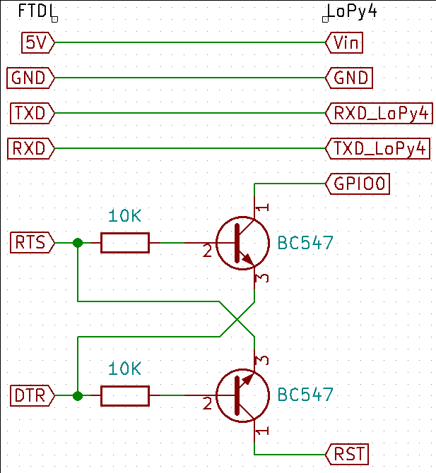
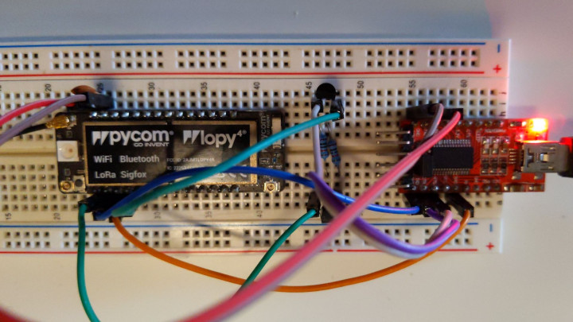
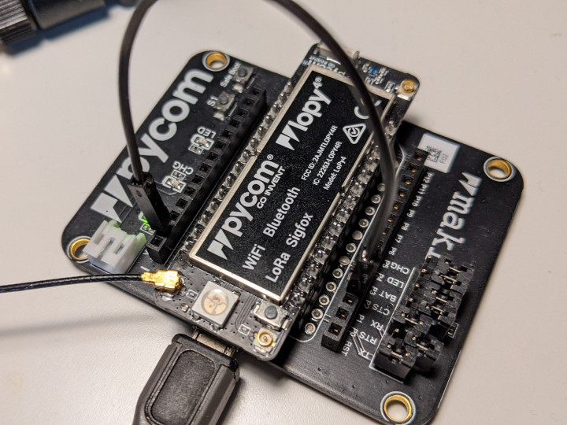

# pycom LoPy4

_Information on the board is available on [pycom.io](https://pycom.io/product/lopy4/)._

The pycom LoPy4 uses a serial interface to talk to the host's TPy node.
Since the board does not come with a USB-to-Serial adapter, you need to setup this connection yourself.
ChirpOTLE supports two options:

| Setup                      | Interface | Remote Flashing/Restart (`chirpotle deploy`) | Local Flashing       |
| -------------------------- | --------- | -------------------------------------------- | -------------------- |
| with USB-to-Serial Adapter | UART      | yes (needs ESP32 reset circuit)              | automated            |
| with pycom Expansion Board | UART      | no                                           | manual               |

## LoPy4 with USB-to-Serial Adapter (e.g. FTDI FT232RL)

For this setup, you need a USB-to-Serial breakout board that:

- Uses 3.3V logic level
- Exposes the 5V VCC from USB
- In addition to TX and RX, also exposes DTR and RTS lines

The LoPy4 is based on an ESP32.
For entering its bootloader mode, one needs to reboot the device while `GPIO0` is pulled low (`P2` on the LoPy4).
The [esptool](https://github.com/espressif/esptool/) which is used for flashing in ChirpOTLE uses the DTR and RTS lines of the serial connection to do this.
Therefore, besides connecting power, ground, RX, and TX from the FTDI to the board, you also need to setup the following reset circuit with two transistors and two resistors:



On a breadboard, that could look like this:



Since this configuration allows full control over the ESP32, remote deployment should work out of the box, if you use the [`lopy4-uart` preconfiguration](../node/companion-app/riot-apps/chirpotle-companion/Makefile.preconf).

## LoPy4 with pycom Expansion Board 3.0/3.1

The pycom Expansion Board uses a custom Serial-to-USB interface to provide additional functionality for the MicroPython distribution on the LoPy4.
It does not include the reset circuitry required by [esptool](https://github.com/espressif/esptool/), and therefore it is not possible to automate the firmware upload process.
However, once the firmware is installed, you can use the board, even remotely.
The following steps explain how you can build and flash the firmware manually.

> **Note:** This will delete the MicroPython installation on your LoPy4. To restore it, you have to re-flash the MicroPython firmware which can be found [here](https://software.pycom.io/downloads/pygate/LoPy4.html). You can also read up on the `esptool read_flash` to make a full backup.

**Step 1:** Install esptool

The esptool is available either via `pip install` or directly on some Linux distributions like Debian:

```bash
# Via pip
pip install esptool
# Debian: Via apt
sudo apt install esptool
```

**Step 2:** Build the firmware

ChirpOTLE's `chirpotle.sh` scripts contains some code to manage dependencies, therefor it is the easiest to use that code to build the firmware images. You can trigger this by creating an empty controller configuration using:

```bash
chirpotle.sh confeditor
```

And then running deploy with this empty configuration file. It will build all variants of the firmware:

```bash
chirpotle.sh deploy --conf your-empty-config-name
```

You should now have a folder `node/companion-app/riot-apps/chirpotle-companion/dist`.

**Step 3:** Preparing the LoPy 4

To kick the ESP32 into bootloader mode, you need to pull `GPIO0` low while resetting the device.
The easiest way to do this on the expansion board is to connect a wire from `GND` to `p2` (which is `GPIO0`) and to then press the reset button on the LoPy4:



It is also a good idea to remove all jumpers except for `tx` and `rx`.

You can verify that the ESP32 has entered the bootloader mode by connecting with a serial monitor (baudrate 115200) to the device during the reset.
It should print something like:

```
Jun  8 2016 00:22:57

rst:0x1 (POWERON_RESET),boot:0x3 (DOWNLOAD_BOOT(UART0/UART1/SDIO_REI_REO_V2))
waiting for download
```

Alternatively, you could run `esptool` with the `read_mac` command to check if it can connect to the ESP32.
If successful, it will print its WiFi MAC address:

```bash
# Assuming you only have one serial port, otherwise add -p /dev/something
esptool read_mac
```

**Step 4:** Flashing the firmware

Navigate to that `dist` folder mentioned in step 2.
From there, run the following command via esptool:

```bash
# Clear NVM 
esptool erase_region 0x9000 0x6000
# Write partition table and new application
esptool write_flash  0x8000 partitions.bin \
                    0x10000 chirpotle-companion.elf.bin
```

If it cannot connect, reset your LoPy4 again and make sure you pulled the right pin low.

After the firmware has been flashed successfully, you have to remove the wire to boot into the firmware again.

**Done:** You can now attach the LoPy4 to the node where you want to use it. If you keep it on your local machine, remeber to reset it after removing the `GPIO0` cable.

> **Tip:** To use a configuration based on the Expansion Board remotely, you have to flash the ChirpOTLE firmware locally as explained above. Once that is done, you can attach the board at the remote location. To avoid trouble when using `chirpotle.sh deploy`, you can create two controller configurations: The first one is deploy-only, which does not include pre-flashed devices like the LoPy4. The second controller configuration includes all boards. For `chirpotle deploy`, use the first configuration, for everything else (`interactive`, `notebook`, ...), use the configurations with all boards in it. This will skip the boards without support for remote flashing during deployment.
